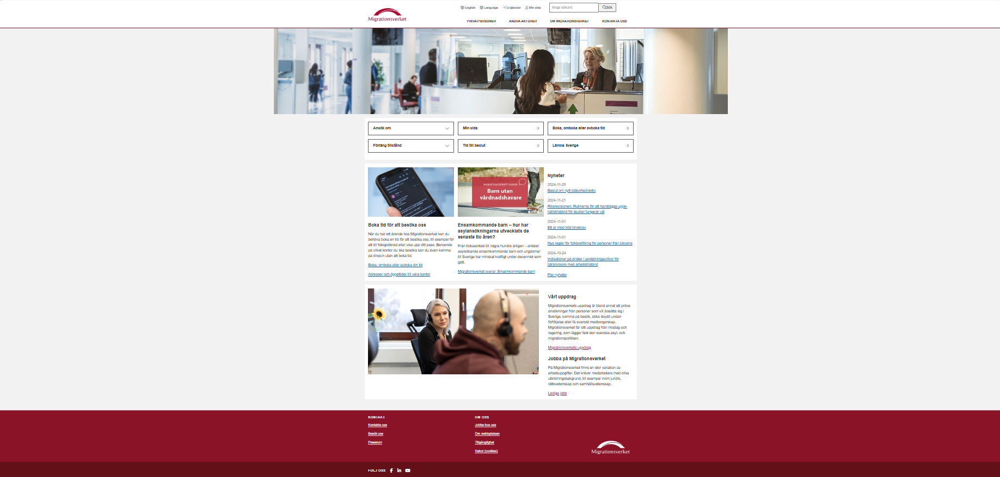
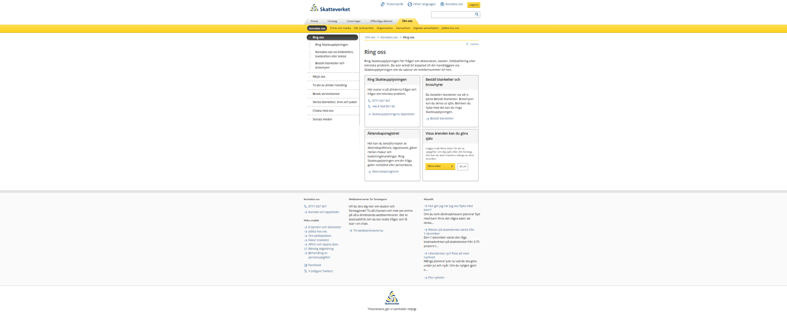
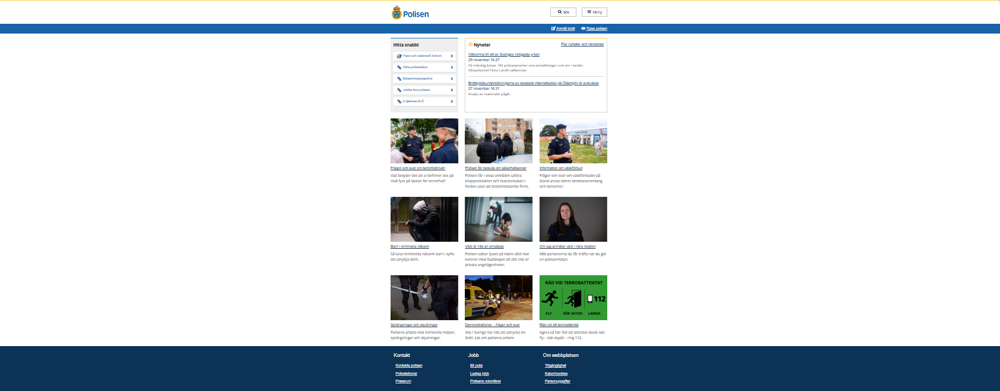

# Färg analys på webbplatser

Uppgiften handlar om att analysera färgpaletter på tre svenska myndighetswebbplatser för att förstå deras användning av färger utifrån färgteori och dess påverkan på användarupplevelse och kommunikation.

## Urval

Berätta vilka webbplatser du valt att undersöka och varför eller hur du gick tillväga när du gjorde ditt urval.

I denna analyserings process har jag valt följande webbsidor:

1. [Migrationsverket.se](https://www.migrationsverket.se/) - Migrationsverkets officiella hemsida.
2. [Skatteverket.se](https://www.skatteverket.se/privat.4.76a43be412206334b89800052864.html) - Skatteverkets officiella hemsida.
3. [Polisen.se](https://polisen.se/) - Polismyndighetens officiella hemsida.
   Dessa webbplatser tillhör är Nationella myndigheters webbplatser och kan klassas i kategorin: Webbsidor till Statliga och offentliga tjänster i Sverige.

## Metod och processn

Berätta kort om din "metod", hur du gör för att utföra undersökningen. Berätta om du använder något speciellt verktyg.

1. Windows Snipping Tool:

2. Adobe Colors:

## Resultat

Dokumentera dina resultat från din studie. Berätta vad du kom fram till, vilka resultat du hittade och observerade.

#### Migrationsverket.se 

#### val av typsnitt
#### Migrationsverket.se
H1-H3: arial, sans-serif;
Brödtext: arial, sans-serif;  
Färgschema är Split-komplementärt  
Anmärkningar:  
Migrationsverkets webbplats val av färger och typsnitt ger ett intryck av auktoritet, tydlighet och pålitlighet, vilket passar väl en seriös myndighet som hanterar migration och asyl.

##### Polisen.se 
H1-H3 Brödtext: "Open Sans Regular", arial,sans-serif;  
Färgschema är Triadiskt  
Anmärkningar:  
Polisens webbplats använder starka och kontrasterande färger som ger ett intryck av trygghet, tydlighet och professionalism, vilket passar deras roll som en samhällsskyddande myndighet.

##### Skatteverket.se
H1-H3: "Open Sans Regular", arial, "Bitstream Vera Sans", lucida, helvetica, sans-serif;
Brödtext: Open Sans Regular, Verdana, sans-serif;  
Färgschema är Analogt  
Anmärkningar:  
Skatteverkets webbplats val av färger och typsnitt är tydliga och professionella med gula och blå toner som signalerar pålitlighet och enkelhet, vilket passar väl deras roll som en viktig myndighet för medborgare.
## Analys

Diskutera och analysera de resultaten du fann.

<!-- # Färgpallett som jag analyserar: -->
<!-- ## Färgpallett som jag analyserar: -->

### Färgpallett som jag analyserar:

Migrationsverket.se 

<table style="border-spacing: 8px; border-collapse: separate">
<tr>
<td style="height: 100px; border: 2px solid #f96e2a; width: 100px; background-color: #641018">
<td style="height: 100px; border: 2px solid #f96e2a; width: 100px; background-color: #8B1327">
<td style="height: 100px; border: 2px solid #f96e2a; width: 100px; background-color: #035AA6">
<td style="height: 100px; border: 2px solid #f96e2a; width: 100px; background-color: #FFFFFF">
<td style="height: 100px; border: 2px solid #f96e2a; width: 100px; background-color: #000000">
</tr>
</table>

Polisen.se 

<table style="border-spacing: 4px; border-collapse: separate">
<tr>
<td style="height: 100px; border: 2px solid #f96e2a; width: 100px; background-color: #338C30">
<td style="height: 100px; border: 2px solid #f96e2a; width: 100px; background-color: #fc3">
<td style="height: 100px; border: 2px solid #f96e2a; width: 100px; background-color: #0F3BBF">
<td style="height: 100px; border: 2px solid #f96e2a; width: 100px; background-color: #1B65A6">
<td style="height: 100px; border: 2px solid #f96e2a; width: 100px; background-color: #035AA6">
<td style="height: 100px; border: 2px solid #f96e2a; width: 100px; background-color: #FFFFFF">
<td style="height: 100px; border: 2px solid #f96e2a; width: 100px; background-color: #000000">
</tr>
</table>

Skatteverket.se
background: linear-gradient(180deg, #ffd93e 0, #f7cc29);
<table style="border-spacing: 4px; border-collapse: separate">
<tr>
<td style="height: 100px; width: 100px; border: 2px solid #f96e2a; background-color: #ffcc00">
<td style="height: 100px; border: 2px solid #f96e2a; width: 100px; gap:25px; background-color: #fc3">
<td style="height: 100px; border: 2px solid #f96e2a; width: 100px; background-color: #3069a1">
<td style="height: 100px; border: 2px solid #f96e2a; width: 100px; background-color: #2069a1">
<td style="height: 100px; border: 2px solid #f96e2a; width: 100px; background-color: #1862a8">
<td style="height: 100px; border: 2px solid #f96e2a; width: 100px; background-color: #f5f5f5">
<td style="height: 100px; border: 2px solid #f96e2a; width: 100px; background-color: #FFFFFF">
<td style="height: 100px; border: 2px solid #f96e2a; width: 100px; background-color: #000000">
</tr>
</table>

## Referenser

Ange de eventuella referenser du använder dig av, om några.

## Övrigt

Rapporten skrven av: Hassan Hussain 
Ackronym: hahi24
